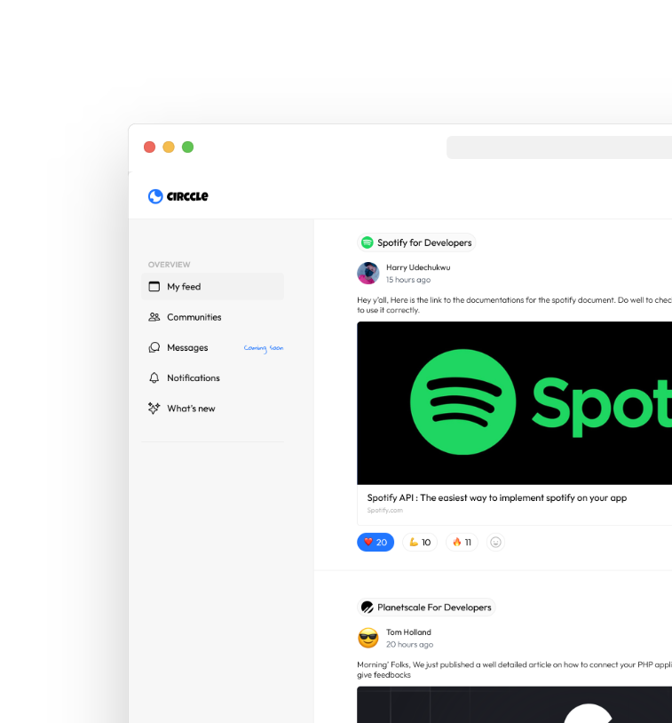

<p align="center">
  <a href="https://circle-one.vercel.app/">
    
  </a>
</p>
<h1 align="center">Circcle</h1>

### Introducing Circcle ✌️

Circcle is an easy to use web application built for every industry to help build a community with stronger bond and faster communication between their users or audience. This awesome project was developed by my friend Harry Udechukwu, chibuzor iroatu and I, Harry is an innovative product designer and chibuzor is a frontend developer who worked effortlessly to make this project come to live with a good user interface.

[Read blog to understand better 📖](https://obayuwanapaul.hashnode.dev/meet-circcle-the-home-for-industry-community)

## 🚀 Demo

<a href="https://circle-one.vercel.app/" target="blank">

</a>

Try the App: [Circcle](https://circle-one.vercel.app/")

## 🧐 Features

Circle has a lot of features we intend to implement based on what i wrote on the blog. But Here are the implemented features

-  **Github/Google Authentication**
-  **User create/edit Profile**
-  **Community Creation** 
-  **Onboarding features**


## 🛠️ Installation Steps

1. Clone the repository

```bash
git clone https://github.com/pauxiel/circle.git
```

2. Change the working directory

```bash
cd circle
```

3. Install dependencies

```bash
npm install
```

4. Create `.env` file in root and add your variables

```bash
DATABASE_URL=
GITHUB_CLIENT_ID=
GITHUB_CLIENT_SECRET
GOOGLE_CLIENT_ID=
GOOGLE_CLIENT_SECRET=
NEXTAUTH_URL=
NEXT_PUBLIC_SECRET=
```

5. Run the app

```bash
npm run dev
```

## 💻 Built with

- [Next JS](https://nextjs.org/) Frontend framework
- [NextAuth](https://next-auth.js.org/): Complete User Authentication
- [Planetscale](https://casesandberg.github.io/react-color/): for Database
- [Prisma](https://html2canvas.hertzen.com/): ORM(Object-Relational Mapping)
- [React-hook-form ](https://github.com/bokuweb/react-rnd): for Form state
- [SWR](https://react-icons.github.io/react-icons/): for  Server cache state

## 🌈 What's next

Circcle is amazing Project. here are some yet to be implemented Project🤞

- Create posts or share useful link **(upcoming)**
- Post reactions **(upcoming)**


